# Imagens Pokémon: velocidade e memória

O caminho de produção é `pokemon-service/src/zapbot/pokemon`, chamado pelo
adaptador `src/zapbot/pokemon_http.cljs`. O antigo `src/zapbot/pokemon` fica
preservado para testes e referência da migração; o entrypoint do Odisseu não
importa esses renderizadores.

```mermaid
flowchart LR
  A[PokeAPI: dados da espécie] --> B[URL de arte]
  B --> C[CDN / origem: dois downloads]
  C --> D[Cache limitado de bytes e sprites]
  D --> E[SVG na resolução final + sprites transparentes]
  E --> F[JPEG 70 / PNG quando precisa de transparência]
  F --> G[MediaStore: conteúdo por SHA]
  G --> H[HTTP binário]
  H --> I[Odisseu: uma conversão Base64]
  I --> J[MessageMedia / WhatsApp]
```

## Gargalos encontrados e mudanças

- Sprites eram baixados novamente no treinador, nos ataques, nas raids e nas
  páginas da coleção. A Pokédex tinha outro caminho de download. Agora todos
  compartilham o cache e o fallback CDN → origem. Consultas de espécies já
  tinham cache em memória; a Pokédex também conserva seu cache persistido.
- Ash, Joy, professor, hospital e loja eram lidos/redimensionados e codificados
  novamente. Artes fixas e sprites redimensionados são reutilizados.
- Cartões usavam PNG em 760×400, e coleção em 1000×1370 para doze Pokémon.
  Agora cartões usam JPEG 70 em 640×337; coleção usa 800×1096. As menores
  fontes da coleção foram aumentadas antes da redução para manter pelo menos
  14,4 pixels no arquivo final. A proporção e as posições dos sprites permanecem.
- O SVG é rasterizado diretamente na resolução de entrega; o cartão pronto
  não é gerado em tamanho grande para ser reduzido depois. Sprites raster não
  são ampliados. Sprites transparentes e imagens isoladas da Pokédex usam PNG;
  as imagens isoladas têm caixa máxima de 360×360.
- Batalhas tinham composição → PNG → decodificação → efeitos → PNG. Agora o
  intermediário é um buffer de pixels, e só a imagem final é codificada em JPEG.
  Fundos também são reutilizados como pixels, evitando codificação intermediária.
- A coleção disparava até doze downloads/processamentos de sprites de uma vez.
  Há dois downloads simultâneos, uma operação Sharp por vez e uma thread libvips.
- `MediaStore.put` reescrevia arquivos idênticos. Agora reutiliza conteúdo por
  SHA, renova a retenção e publica novos bytes/metadados por rename de arquivos
  temporários privados. Operações do mesmo ID são ordenadas, incluindo limpeza.
- O cliente HTTP acumulava chunks e copiava toda a mídia em `Buffer.concat`.
  Com `Content-Length` válido e dentro do limite, preenche diretamente o buffer
  final; com resposta chunked, reutiliza o chunk único ou concatena uma vez.
  Tamanhos excedidos, truncamento e timeout continuam sendo recusados.

O HTTP já usava bytes, sem imagens Base64 no JSON. A conversão única ocorre em
`desempenho/codificar-base64!`, antes de construir `MessageMedia`. Essa string
tem aproximadamente 4/3 do tamanho binário. O WhatsApp ainda precisa transportar
essa string para o Chromium e preparar o upload; reduzir o arquivo reduz esses
custos. O patch de compatibilidade do `whatsapp-web.js` foi preservado.

Fora do Pokémon, `pergunta` lia a foto Abujamra com `readFileSync` em cada
resposta. Agora a leitura/conversão Sharp é assíncrona, gera JPEG 70 com largura
máxima de 640 sem ampliar e compartilha uma única foto/base64 em cache. Gemini
continua sendo chamado por pergunta; somente a arte é reutilizada. `bola8`
reutiliza PNG/base64 por resposta, num conjunto finito de vinte imagens,
preservando sua transparência. Falhas de processamento permitem tentar de novo;
cada envio cria seu próprio `MessageMedia`. Os posters de `filme` já usam a URL
TMDB de largura 500; não foi adicionada outra rodada de resize no navegador.

## Limites

O cache LRU é compartilhado por bytes baixados, sprites, fundos e artes fixas:
máximo de 16 MiB de buffers e 128 entradas, com validade de dez minutos. Há
deduplicação de trabalho simultâneo por chave; falhas não entram no cache. Não
há cache em disco, timers de limpeza ou mudanças em dados/configuração Cassandra.
A chave de sprite inclui sua escala para evitar uma segunda redução ao alternar
entre batalha e coleção.

Cada sprite pode gastar até doze segundos no conjunto fila + CDN + origem,
com até seis segundos por tentativa de host. O tempo restante limita o sinal
de cancelamento da requisição e do corpo; itens que expiraram na fila usam o
fallback sem iniciar outro download. Assim doze sprites indisponíveis não
viram seis lotes sucessivos de doze segundos. Cada download aceita até 4 MiB;
Sharp limita a entrada a 16 megapixels. Filas Sharp/download aceitam até 128
operações aguardando. PNGs intermediários transparentes usam compressão rápida.

Os 16 MiB limitam o cache de buffers, não a memória total do processo: Node,
libvips, operações ativas, chaves e respostas também consomem memória. A cache
interna do Sharp fica em 8 MiB/32 itens, sem arquivos abertos em cache.

Não foi adicionado envio paralelo de mensagens: a ordem das respostas,
menções, legendas, recibos e regras do jogo permanece. Flags read-only,
schedulers, configuração de deploy e variáveis de ambiente não foram alterados.

## Medição local

[Resultado completo](pokemon-images-benchmark.json): Node 22.22.0, Sharp 0.35.3,
macOS ARM64. Renderizadores reais antes/depois, mesmo sprite SVG local de
475 pixels, processos separados, três aquecimentos e vinte amostras. Nenhum
acesso à PokeAPI, Cassandra ou WhatsApp. Tamanhos abaixo usam KB decimais;
tempo é a mediana com cache aquecido.

| Imagem | Arquivo antes → depois | Geração antes → depois | Redução de bytes |
| --- | --- | --- | --- |
| Treinador | 175,6 → 14,5 KB | 14,6 → 2,6 ms | 91,7% |
| Batalha com efeito | 31,7 → 13,3 KB | 7,8 → 3,5 ms | 58,1% |
| Raid | 57,6 → 18,4 KB | 6,0 → 1,9 ms | 68,0% |
| Coleção de doze | 127,0 → 96,9 KB | 24,9 → 7,8 ms | 23,7% |

O pico de RSS do processo no benchmark passou de 232,4 para 176,1 MiB. Isso
descreve essa execução local, não garante o mesmo consumo numa VM. Execuções
frias continuam pagando decodificação e preenchimento do cache: nessa amostra,
raid fria passou de 7,8 para 16,6 ms. Os resultados completos incluem esses
tempos; não há promessa de aceleração de todo primeiro acesso ou envio real.

Com os mesmos pixels de treinador em 640×337, somente a codificação mediu:
PNG 151,5 KB/3,62 ms; JPEG 70 14,4 KB/0,79 ms; WebP 70 8,4 KB/7,01 ms.
JPEG foi escolhido pela velocidade de codificação e compatibilidade do fluxo
de imagem existente. WebP produz arquivo menor nesse exemplo, mas custa mais CPU.
As opções de saída e a ordem de resize/composição foram conferidas na documentação
[Sharp: saída](https://sharp.pixelplumbing.com/api-output/) e
[Sharp: composição](https://sharp.pixelplumbing.com/api-composite/).

Para reproduzir, compile `npx shadow-cljs release benchmark` em
`pokemon-service` e execute `node scripts/benchmark-pokemon-images.cjs` na raiz.
Para comparar, compile o mesmo `test/pokemon_benchmark.cljs` e os mesmos exports
em uma cópia isolada da revisão anterior; use
`node scripts/benchmark-pokemon-images.cjs --before /copia/target/benchmark.cjs`.
O target de benchmark não é incluído na imagem de produção.

## Validação

Os testes cobrem JPEG real, dimensões, transparência dos sprites, posição de
camadas, troca de escala, downloads concorrentes, orçamento da fila, TTL/LRU,
recuperação de falhas, limite de bytes, publicação/reuso da mídia e transporte
binário fragmentado. A regressão do domínio mantém persistência falsa e timers
desativados. Houve inspeção visual dos cartões de treinador, batalha e coleção.
Os testes de `pergunta` e `bola8` usam envios/Gemini falsos, verificam os formatos
reais e cobrem reuso simultâneo, recuperação após falha e isolamento dos objetos
de mídia por envio.
Também foram executados os testes Node do serviço num container Linux AMD64
local, sem rede externa, com uma CPU e limite de 384 MiB.

Resultado final: 196 testes ClojureScript do ZapBot, 150 do domínio Pokémon e
49 testes Node de serviço/contrato/transporte passaram. Os builds de produção
`app` e `domain` concluíram, e o patch de mídia do WhatsApp foi verificado.
A suíte ZapBot rodou offline em Docker, com uma CPU e 512 MiB. A foto Abujamra
real passou de 211.901 bytes PNG para 14.100 bytes JPEG, mantendo 500×343.

Envio real em WhatsApp, latência entre VMs e cold start de rede precisam de
medição no ambiente autorizado. Esta alteração não executou deploy, comandos
reais do jogo ou reinícios de VMs/containers de produção.
